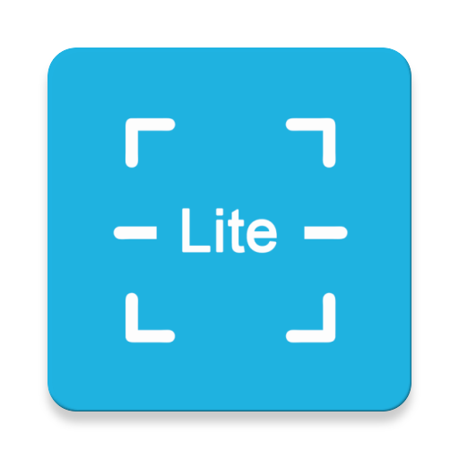

# ZXingLite



[](https://raw.githubusercontent.com/jenly1314/ZXingLite/master/app/release/app-release.apk)
[](https://jitpack.io/#jenly1314/ZXingLite)
[](https://travis-ci.org/jenly1314/ZXingLite)
[](https://android-arsenal.com/api?level=16)
[](http://www.apache.org/licenses/LICENSE-2.0)
[](http://blog.csdn.net/jenly121)

ZXingLite for Android 是ZXing的精简版，基于ZXing库优化扫码和生成二维码/条形码功能，扫码界面完全支持自定义，也可一行代码使用默认实现的扫码功能。总之你想要的都在这里。
>简单如斯，你不试试？ Come on~

## Gif 展示


## ViewfinderView属性说明
| 属性 | 值类型 | 默认值 | 说明 |
| :------| :------ | :------ | :------ |
| maskColor | color |<font color=#000000>#60000000</font>| 扫描区外遮罩的颜色 |
| frameColor | color |<font color=#1FB3E2>#7F1FB3E2</font>| 扫描区边框的颜色 |
| cornerColor | color |<font color=#1FB3E2>#FF1FB3E2</font>| 扫描区边角的颜色 |
| laserColor | color |<font color=#1FB3E2>#FF1FB3E2</font>| 扫描区激光线的颜色 |
| resultPointColor | color |<font color=#EFBD21>#C0EFBD21</font>| 扫描区结果点的颜色 |
| labelText | string |  | 扫描提示文本信息 |
| labelTextColor | color |<font color=#C0C0C0>#FFC0C0C0</font>| 提示文本字体颜色 |
| labelTextSize | dimension |14sp| 提示文本字体大小 |
| labelTextPadding | dimension |24dp| 提示文本距离扫描区的间距 |
| showResultPoint | boolean | false | 是否显示合适的扫码结果点 |
| frameWidth | dimension |  | 扫码框宽度，需与frameHeight同时使用才有效 |
| frameHeight | dimension |  | 扫码框高度，需与frameWidth同时使用才有效 |


## 引入

### Maven：
```maven
<dependency>
  <groupId>com.king.zxing</groupId>
  <artifactId>zxing-lite</artifactId>
  <version>1.0.5</version>
  <type>pom</type>
</dependency>
```
### Gradle:
```gradle
implementation 'com.king.zxing:zxing-lite:1.0.5'
```
### Lvy:
```lvy
<dependency org='com.king.zxing' name='zxing-lite' rev='1.0.5'>
  <artifact name='$AID' ext='pom'></artifact>
</dependency>
```

###### 如果Gradle出现compile失败的情况，可以在Project的build.gradle里面添加如下：（也可以使用上面的GitPack来complie）
```gradle
allprojects {
    repositories {
        maven { url 'https://dl.bintray.com/jenly/maven' }
    }
}
```

## 引入的库：
```gradle
compileOnly 'com.android.support:appcompat-v7:27.1.1'
api 'com.google.zxing:core:3.3.3'
```

## 示例

布局示例 （可自定义布局，布局内至少要保证有SurfaceView和ViewfinderView，控件id可根据重写CaptureActivity 的 getPreviewViewId 和 getViewFinderViewId方法自定义）
```Xml
    <merge xmlns:android="http://schemas.android.com/apk/res/android">
        <SurfaceView
            android:id="@+id/preview_view"
            android:layout_width="match_parent"
            android:layout_height="match_parent"/>
        <com.king.zxing.ViewfinderView
            android:id="@+id/viewfinder_view"
            android:layout_width="match_parent"
            android:layout_height="match_parent"/>
    </merge>
```

代码示例 （二维码/条形码）
```Java
    //跳转的默认扫码界面
    startActivityForResult(new Intent(context,CaptureActivity.class),requestCode);

    //生成二维码
    CodeUtils.createQRCode(content,600,logo);
    //生成条形码
    CodeUtils.createBarCode(content, BarcodeFormat.CODE_128,800,200);
```

更多使用详情，请查看[app](app)中的源码使用示例

## 关于我
   Name: <a title="关于作者" href="https://about.me/jenly1314" target="_blank">Jenly</a>

   Email: <a title="欢迎邮件与我交流" href="mailto:jenly1314@gmail.com" target="_blank">jenly1314#gmail.com</a> / <a title="给我发邮件" href="mailto:jenly1314@vip.qq.com" target="_blank">jenly1314#vip.qq.com</a>

   CSDN: <a title="CSDN博客" href="http://blog.csdn.net/jenly121" target="_blank">jenly121</a>

   Github: <a title="Github开源项目" href="https://github.com/jenly1314" target="_blank">jenly1314</a>

   微信公众号:

   

   加入QQ群: <a title="点击加入QQ群" href="http://shang.qq.com/wpa/qunwpa?idkey=8fcc6a2f88552ea44b1411582c94fd124f7bb3ec227e2a400dbbfaad3dc2f5ad" target="_blank">20867961</a>


   